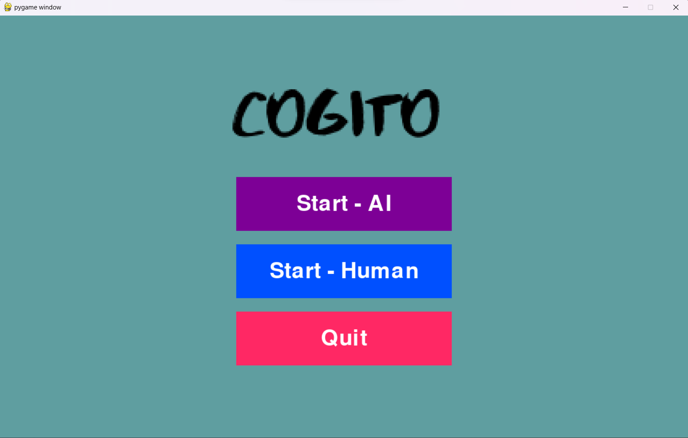
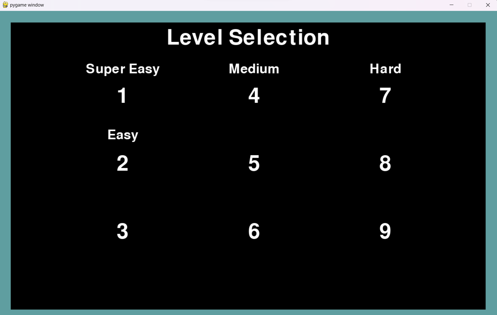
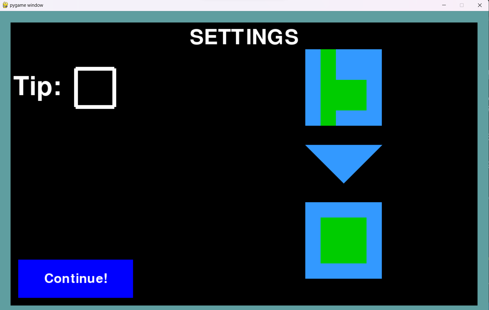
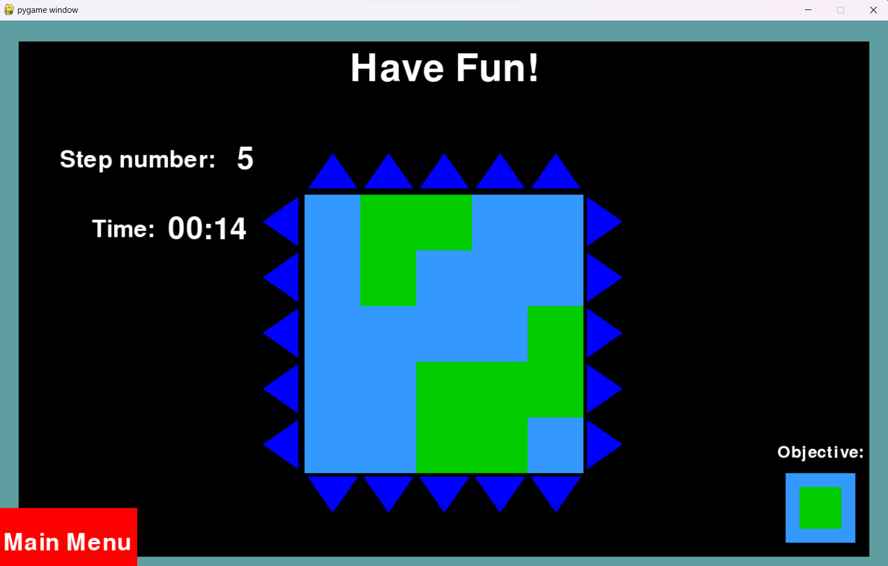
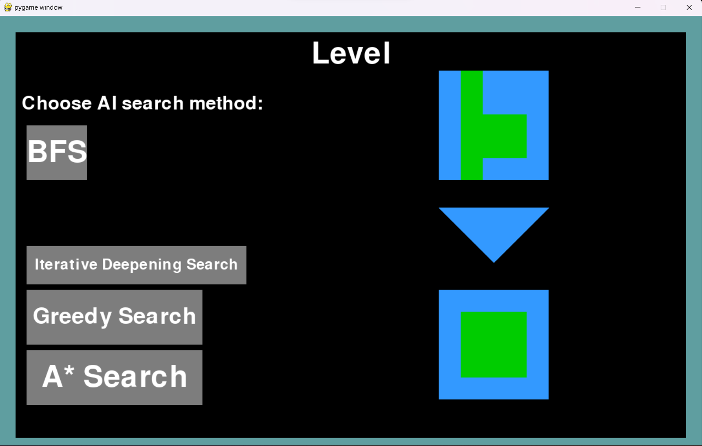
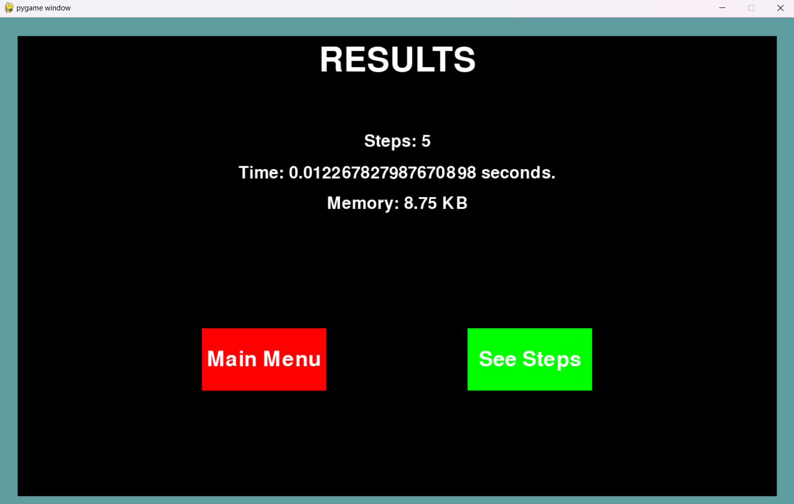
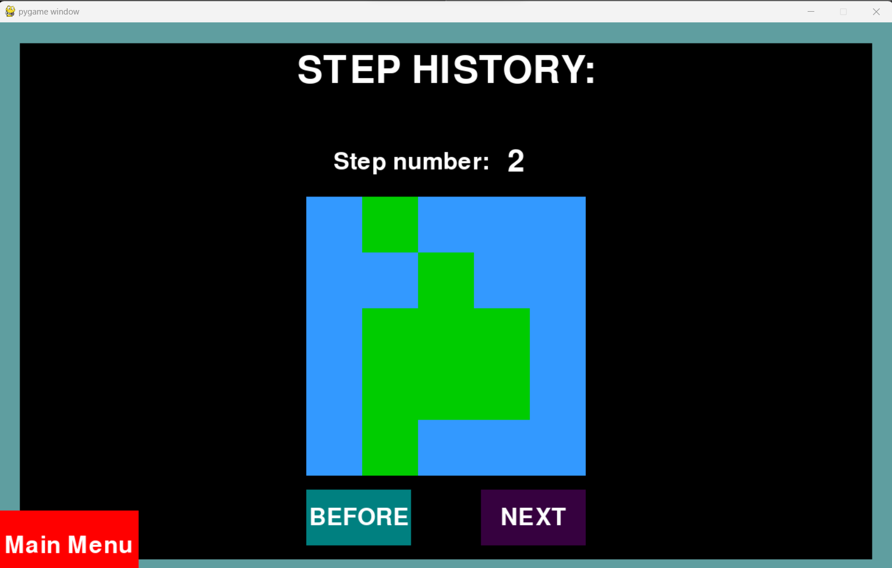

# Cogito

O jogador tem a opção de jogar a versão humana e a opção de inteligência artifical, onde é deparado com a escolha de vários níveis de diferentes dificuldades. O jogador pode escolher o nível que deseja jogar e a inteligência artificial vai dizer, passo a passo, como resolver o tabuleiro de acordo com o método de busca escolhido.

## Screenshots

Menu inicial do jogo:


Menu de seleção de níveis:


Menu do objetivo do nivel:


Jogo:


Escolha de algoritmos de busca:


Tempo de busca


Passo a passo da resolução do tabuleiro:



## Descrição do Projeto
O projeto desenvolvido aborda os conceitos e técnicas estudados na disciplina de Inteligência Artificial, com ênfase em jogos e resolução de problemas. Ele consiste na implementação de um jogo de solitário para um jogador, onde diferentes métodos de busca são aplicados para resolver os níveis do jogo. O objetivo é comparar o desempenho desses métodos em termos de qualidade da solução, eficiência e uso de recursos.
Para obter mais informações sobre o enunciado e os detalhes específicos do projeto, consulte a [página da disciplina IART](https://sigarra.up.pt/feup/pt/UCURR_GERAL.FICHA_UC_VIEW?pv_ocorrencia_id=520334).

## Estrutura do Repositório
- **Exercises:** Exercícios práticos da cadeira.
- **Proj1:** Contém o código-fonte do primeiro projeto.
  - **__pycache__:** Diretório que armazena arquivos cache do Python.
  - **Font:** Diretório com fontes utilizadas no projeto.
  - **Images:** Diretório que contém imagens usadas no jogo.
  - **gitignore:** Arquivo de configuração do Git para ignorar determinados arquivos e diretórios.
  - **algorithms.py:** Implementação de algoritmos relevantes para o projeto.
  - **context.pdf:** Ficheiro com o enunciado do Projeto.
  - **draw.py:** Módulo para desenho na interface gráfica.
  - **gamelogic.py:** Implementação da lógica do jogo.
  - **levels.py:** Definição dos níveis do jogo.
  - **main.py:** Ponto de entrada principal do programa.
  - **utils.py:** Módulo com utilidades diversas.
- **Proj2:** Contém o código-fonte do segundo projeto.
- **README.md:** Documentação principal do projeto.

## Instruções de Execução
1. Certifique-se de ter o Python e o Pygame instalados em seu sistema.
2. Execute o arquivo `main.py` para iniciar o programa.

## Jogo
O jogo [Cogito] é um jogo de solitário para um jogador. O jogo começa com um tabuleiro baralhado e o objetivo é conseguir formar um quadrado ao centro conforme o pedido.

## Setup
Para executar o jogo é necessario ter algumas livrarias do python instaladas. Para tal basta executar o seguinte comando:
```bash
pip install pygame
pip install numpy
```

## Dar início ao jogo
Para dar início ao jogo basta executar o seguinte comando dentro do dirétorio do "Proj1":
```bash
python3 main.py
```

# Ficheiros
- **main.py:** Ficheiro principal do jogo.
  Este ficheiro é o ponto de entrada do jogo. Inicia primeiro o menu principal e, só após selecionar o nível, é que o jogo é iniciado. Se o nível fornecido pelo menu for vazio, então o ciclo do jogo é interrompido. Além disso, se game.run() retornar falso, devido a uma saída intencional, o ciclo é quebrado. É aqui que o fluxo geral do jogo é controlado, desde a inicialização até à execução do ciclo de jogo principal.

- **gamelogic.py:** Ficheiro com a lógica do jogo.
  Este ficheiro contém a classe GameLogic, que é responsável por gerir o estado do jogo, como o tabuleiro, o nível atual, o estado do jogo, etc. Além disso, contém métodos para verificar se o jogo foi resolvido, para verificar se um movimento é válido, para mover uma peça, para baralhar o tabuleiro, etc.

- **draw.py:** Ficheiro com funções de desenho.
  Este ficheiro contém funções para desenhar o tabuleiro, as peças, o menu, etc. Além disso, contém funções para desenhar o botão, o texto, o quadrado, etc.

- **algorithms.py:** Ficheiro com algoritmos de busca.
  Este ficheiro contém a implementação dos algoritmos de busca utilizados para resolver o jogo. Os algoritmos implementados são a BFS, A* Search, Iterative deepening Search e Greedy Search. Além disso, contém funções auxiliares para a implementação desses algoritmos.

- **levels.py:** Ficheiro com os níveis do jogo.
  Este ficheiro contém a definição dos níveis do jogo. Cada nível é representado por um dicionário. O valor da chave "board" é uma lista de listas que representa o tabuleiro do nível. O valor da chave "target" é uma lista de listas que representa o objetivo do nível. 

- **utils.py:** Ficheiro com funções utilitárias.
  Este ficheiro contém funções utilitárias que são usadas em todo o projeto. Além disso, contém funções para carregar imagens, para desenhar texto, para desenhar um botão, etc.